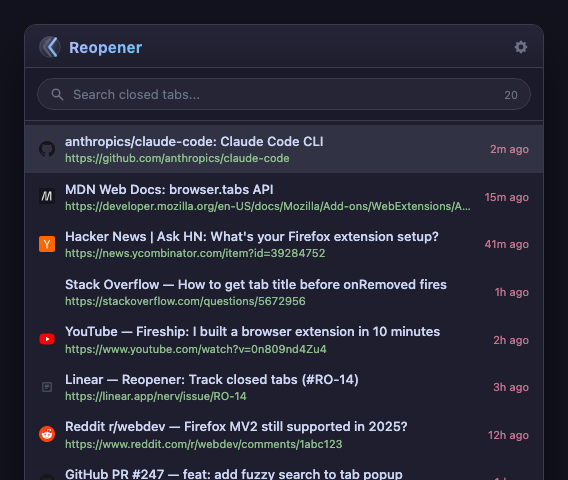
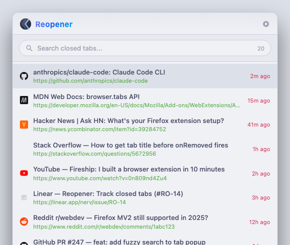
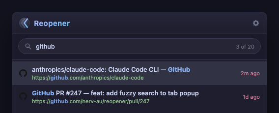

# Reopener

A Firefox extension that tracks every tab you close and lets you find and restore them instantly.

## Features

- **Unlimited history** — remembers up to 9,999 closed tabs by default (configurable)
- **Fuzzy search** — search by page title or URL; results rank title matches above URL matches
- **Favicons** — displays cached favicons with Google's favicon service as a fallback
- **Relative timestamps** — see how long ago each tab was closed at a glance
- **Keyboard navigation** — arrow keys to move, Enter to open, Delete to remove an entry
- **Seeded on install** — pre-populated from Firefox's built-in session history the first time it runs
- **Light, dark and auto themes** — follows your OS appearance or pin to either mode
- **Lightweight** — no external dependencies, no background network requests

## Screenshots

### Dark mode

### Light mode

### Search

Type to instantly filter by title or URL. Matching characters are highlighted and results are counted.

## Installation

### Firefox Add-ons (recommended)

Install directly from [addons.mozilla.org](https://addons.mozilla.org) — search for **Reopener**.

### Manual (developer mode)

1. Clone or download this repository
2. Open Firefox and go to `about:debugging`
3. Click **This Firefox** in the sidebar
4. Click **Load Temporary Add-on...**
5. Select the `manifest.json` file from this directory

## Usage

Click the **Reopener** button in the Firefox toolbar to open the popup.

| Action | Key |
|---|---|
| Move selection down | `↓` |
| Move selection up | `↑` |
| Open selected tab | `Enter` |
| Remove selected entry | `Delete` |
| Close popup | `Esc` |

The first result is always pre-selected so you can hit Enter immediately to reopen the most recently closed tab.

## Settings

Open the settings page via the gear icon in the popup, or through `about:addons` → Reopener → Preferences.

| Setting | Default | Description |
|---|---|---|
| Appearance | Auto | Light, Dark, or Auto (follows OS) |
| Maximum tabs | 9,999 | How many closed tabs to keep in history |
| Clear history | — | Wipes all stored tab history |

## Privacy

All tab history is stored locally in `browser.storage.local` and never leaves your device.

When a tab does not have a cached favicon, Reopener falls back to `https://www.google.com/s2/favicons?domain=<hostname>` to fetch one. Only the hostname (e.g. `github.com`) is sent — never the full URL, page title, or any other data.

## License

MIT — see [LICENSE](LICENSE) for details.
